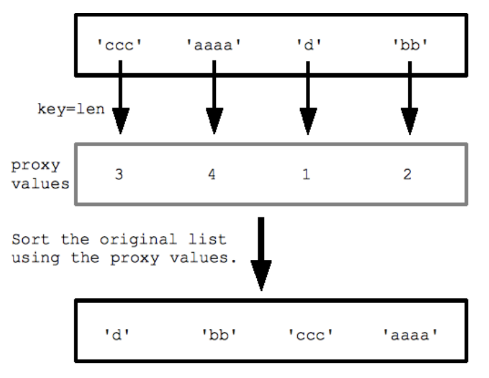

# Lesson 3: Python Types, simple types, Lists, Tuples and Sorting

<a href="../../../Lesson-02-Introduction-to-Python-and-Python-Strings/blob/master/README.md">prev</a> | 
<a href="https://python-elective-2-spring-2019.github.io/">index</a> | 
<a href="../../../Lesson-04-Dictionary-Sets-Reading-and-Writing-Files/blob/master/README.md">next</a>

> Agenda 22-02-2019

Today we will talk about Lists and Tuples. We will also look at how to sort list and you will have some exercises covering the topic of today.  

## Required reading
* [3.1.3. Lists](https://docs.python.org/3/tutorial/introduction.html#lists)
* [4.2. for Statements](https://docs.python.org/3/tutorial/controlflow.html#for-statements)
* [4.3. The range() Function](https://docs.python.org/3/tutorial/controlflow.html#the-range-function)
* [5.1. More on Lists](https://docs.python.org/3/tutorial/datastructures.html#more-on-lists)
* [4.2. for Statements](https://docs.python.org/3/tutorial/controlflow.html#for-statements)
* [4.3. The range() Function](https://docs.python.org/3/tutorial/controlflow.html#the-range-function)
* [5.1. More on Lists](https://docs.python.org/3/tutorial/datastructures.html#more-on-lists)
* [5.3. Tuples and Sequences](https://docs.python.org/3/tutorial/datastructures.html#tuples-and-sequences)
* [Sorting HOW TO](https://docs.python.org/3/howto/sorting.html#sorting-how-to)

### Suplementary reading

## Exercises
* [list1.py](exercises/list1.py)
* [list2.py](exercises/list2.py)
* [solutions](exercises/solution/)

## Sorting

<a href="../../../Lesson-02-Introduction-to-Python-and-Python-Strings/blob/master/README.md">prev</a> | 
<a href="https://python-elective-2-spring-2019.github.io/">index</a> | 
<a href="../../../Lesson-04-Dictionary-Sets-Reading-and-Writing-Files/blob/master/README.md">next</a>

